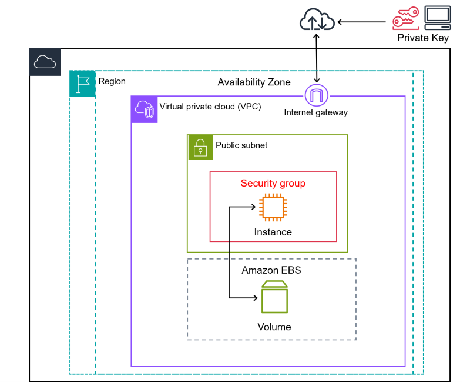

# Amazon EC2
## What is EC2?
[EC2](https://docs.aws.amazon.com/AWSEC2/latest/UserGuide/concepts.html) is a cloud computing service offered by Amazon Web Services (AWS). It allows users to rent virtual machines in the cloud, known as EC2 instances, and run applications on them. These instances can be configured according to the user's needs in terms of processing power, memory, storage, and other resources.

**Here are some features or configurations for EC2 instances.**
## AMIs
Amazon Machine Images (AMIs) are pre-configured templates for EC2 instances. When you launch an instance in EC2, you start with an AMI. An AMI includes details such as the operating system to use, applications to install, and the volume type and size. AMIs can be either public or private — public AMIs are available for anyone to use, while private AMIs are only available to specific AWS accounts. You can create your own custom AMIs, enabling you to quickly start and replicate a known configuration for your EC2 instances.

## EBS
Amazon [Elastic Block Store](https://docs.aws.amazon.com/ebs/latest/userguide/what-is-ebs.html) (Amazon EBS) is a service that provides scalable and high-performance block storage resources for use with EC2 instances. It allows users to create and manage storage volumes (Amazon EBS volumes) that can be attached to EC2 instances, similar to local hard drives, and snapshots of these volumes for backups. Amazon EBS offers multiple volume types, scalability options, backup and recovery features, data protection through encryption, data availability and durability guarantees, as well as data archiving capabilities.

## Security Groups

[Security groups](https://docs.aws.amazon.com/vpc/latest/userguide/vpc-security-groups.html) in AWS are used to control the inbound and outbound traffic for associated resources within a Virtual Private Cloud (VPC). When a security group is assigned to an EC2 instance, it acts as a virtual firewall, allowing only traffic that complies with the defined rules to reach the instance. These rules specify the allowed source, port range, and protocol for inbound traffic, as well as the destination, port range, and protocol for outbound traffic. Security groups are stateful, meaning that response traffic for allowed requests is permitted regardless of the inbound rules. However, security groups do not filter certain types of traffic like DNS, DHCP, or metadata requests.

In summary, security groups play a crucial role in controlling traffic to AWS resources within a VPC by defining rules for inbound and outbound traffic based on specified criteria such as source, destination, port range, and protocol. Following best practices when configuring security groups helps enhance the security posture of AWS environments.

## Elastic IP
[Elastic IP](https://docs.aws.amazon.com/AWSEC2/latest/UserGuide/elastic-ip-addresses-eip.html) in AWS EC2 is a static IPv4 address designed for dynamic cloud computing. An Elastic IP address is associated with your AWS account not a particular instance, and you control that address until you choose to explicitly release it. Unlike traditional static IP addresses, however, Elastic IP addresses allow you to mask the failure of an instance or software by rapidly remapping the address to another instance in your account.

## Keypairs
A [key pair](https://docs.aws.amazon.com/AWSEC2/latest/UserGuide/ec2-key-pairs.html) in Amazon EC2 consists of a public key and a private key used for identity verification when connecting to an EC2 instance. The public key is stored on the instance, while the private key is kept by the user. For Linux instances, the private key enables secure SSH access to the instance. It is crucial to safeguard the private key as anyone with it can access the instances. When launching an instance, a key pair must be specified for SSH connections, which can be an existing one or a new pair. The public key specified during launch is placed on the Linux instance for authentication. If the private key is lost, there is no way to recover it, but alternative methods exist to connect to instances without it. Amazon EC2 allows creating key pairs directly or importing public keys from third-party tools.

## User Data Scripts
[User Data Scripts](https://docs.aws.amazon.com/AWSEC2/latest/UserGuide/user-data.html) in EC2 instances are used to perform common automated configuration tasks and even run scripts after the instance starts. These scripts run as the root user, and can be used to install software or download files from an S3 bucket. You can pass up to 16 KB of data to an instance, either as plain text or base64-encoded. The User Data script is executed only one time when the instance is first launched. If you stop and start the instance, the script does not run again. However, it will run on every boot if the instance reboots.

## Elastic Load Balancer
[Elastic Load Balancing](https://docs.aws.amazon.com/elasticloadbalancing/latest/userguide/what-is-load-balancing.html) is a service that automatically distributes incoming traffic across multiple targets, such as EC2 instances, containers, and IP addresses, in one or more Availability Zones. It ensures the health of registered targets and directs traffic only to healthy ones. The service also adjusts load balancer capacity in response to changes in incoming traffic. Using a load balancer enhances the availability and fault tolerance of applications by distributing workloads across multiple compute resources. Elastic Load Balancing supports various types of load balancers, including Application Load Balancers, Network Load Balancers, Gateway Load Balancers, and Classic Load Balancers, allowing users to choose the type that best fits their needs. 

## Auto Scaling Groups
[Auto Scaling groups](https://docs.aws.amazon.com/autoscaling/ec2/userguide/auto-scaling-groups.html) are a fundamental feature of the Amazon EC2 Auto Scaling service. They consist of a collection of EC2 instances grouped together for automatic scaling and management purposes. These groups allow users to leverage various features such as health check replacements and scaling policies. The size of an Auto Scaling group is determined by the desired capacity, which can be adjusted manually or through automatic scaling based on demand. The group ensures a fixed number of instances by launching replacements for unhealthy instances and adjusting capacity dynamically using scaling policies. Users can choose to launch On-Demand Instances, Spot Instances, or both when creating an Auto Scaling group, with Spot Instances offering cost savings compared to On-Demand prices. When a Spot Instance is terminated, the Auto Scaling group works to launch a replacement instance to maintain the desired capacity. Additionally, instances can be distributed across multiple Availability Zones for better fault tolerance and load distribution.

